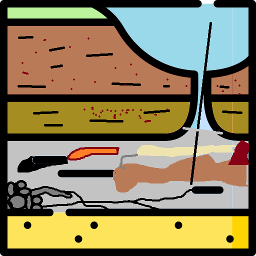
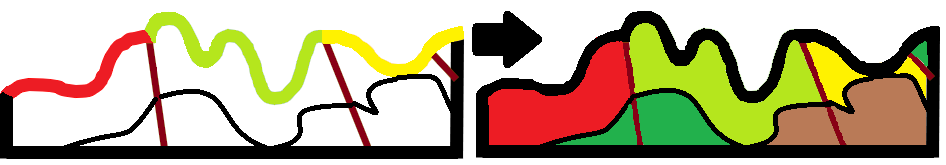

<p align="right">
  <strong>English</strong> | <a href="README_ES.md">Español</a>
</p>

<p align="center">
  
</p>

<h1 align="center">SecGeol</h1>

**SecGeol** is a QGIS plugin for generating geological cross sections and reconstructing interpreted profiles in 3D.

It provides an integrated workflow for creating topographic profiles from DEMs or contour lines, incorporating geological and structural information, converting interpreted profile lines into geological polygons, and reconstructing the resulting cross section in real-world 3D coordinates.

## Main features

SecGeol provides three complementary workflows:

### 1. Section to profile

- Generates topographic profiles from a DEM or contour lines.
- Uses a user-defined section line.
- Supports optional geological polygon and structural line layers.
- Allows reversing the section direction.
- Generates a spatial guide section for subsequent 3D reconstruction.
- Provides optional profile axes and configurable profile dimensions.

<p align="center">
  
</p>

### 2. Lines to polygons

- Converts interpreted geological profile lines into closed polygons.
- Assigns geological information to the generated polygons.
- Supports optional reference axes for profile interpretation.

<p align="center">
  
</p>

### 3. 2D profile to 3D

- Reconstructs interpreted geological polygons from local profile coordinates into real-world 3D coordinates.
- Uses the guide section generated during the first workflow to preserve the spatial reference of the original section.

<p align="center">
  
</p>


## Documentation

A complete bilingual user manual (English and Spanish) is available at:

https://aurarlora.github.io/secgeol/en/

The manual includes workflow descriptions, input requirements, step-by-step procedures, and guidance for the three main SecGeol tools.

## Requirements

- QGIS 4.x
- Qt6-compatible QGIS environment
- Input layers loaded in the current QGIS project
- A projected CRS is recommended for profile generation

## Repository structure

```text
secgeol/
├── core/
├── docs/
├── i18n/
├── resources/
├── validation/
├── __init__.py
├── metadata.txt
├── secgeol.py
├── secgeol_dialog.py
├── secGeol.ui
├── icon.png
├── LICENSE
└── README.md
```

## Author

**Aura Ramos Lora**

Developer and maintainer of SecGeol.

## License

SecGeol is distributed under the GNU General Public License v3.0 (GPL-3.0).

Copyright © 2026 Aura Ramos Lora.

See the LICENSE file for details.

