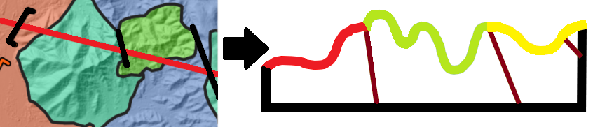
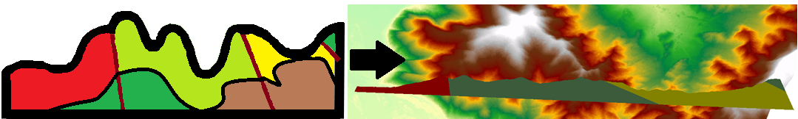

<p align="right">
  <a href="README.md">English</a> | <strong>Español</strong>
</p>


<p align="center">
  
</p>

<h1 align="center">SecGeol</h1>

**SecGeol** es un complemento de QGIS para generar secciones geológicas y reconstruir perfiles interpretados en 3D.

Proporciona un flujo de trabajo integrado para crear perfiles topográficos a partir de modelos digitales de elevación (MDE) o curvas de nivel, incorporar información geológica y estructural, convertir líneas interpretadas del perfil en polígonos geológicos y reconstruir la sección resultante en coordenadas 3D del mundo real.

## Características principales

SecGeol proporciona tres flujos de trabajo complementarios:

### 1. Sección a perfil

- Genera perfiles topográficos a partir de un MDE o curvas de nivel.
- Utiliza una línea de sección definida por el usuario.
- Permite incorporar de manera opcional capas de polígonos geológicos y líneas estructurales.
- Permite invertir la dirección de la sección.
- Genera una sección guía espacial para la posterior reconstrucción 3D.
- Permite crear ejes opcionales y configurar las dimensiones del perfil.

<p align="center">
  
</p>

### 2. Líneas a polígonos

- Convierte las líneas interpretadas del perfil geológico en polígonos cerrados.
- Asigna información geológica a los polígonos generados.
- Permite utilizar ejes de referencia opcionales para la interpretación del perfil.

<p align="center">
  
</p>

### 3. Perfil 2D a 3D

- Reconstruye los polígonos geológicos interpretados desde las coordenadas locales del perfil hacia coordenadas 3D del mundo real.
- Utiliza la sección guía generada durante el primer flujo de trabajo para conservar la referencia espacial de la sección original.

<p align="center">
  
</p>


## Documentación

El manual completo de usuario está disponible en español e inglés:

https://aurarlora.github.io/secgeol/es/

El manual incluye la descripción de los flujos de trabajo, los requisitos de entrada, procedimientos paso a paso y orientación para utilizar las tres herramientas principales de SecGeol.

## Requisitos

- QGIS 4.x
- Entorno QGIS compatible con Qt6
- Capas de entrada cargadas en el proyecto actual de QGIS
- Se recomienda utilizar un CRS proyectado para la generación del perfil

## Estructura del repositorio

```text
secgeol/
├── core/
├── docs/
├── i18n/
├── resources/
├── validation/
├── __init__.py
├── metadata.txt
├── secgeol.py
├── secgeol_dialog.py
├── secGeol.ui
├── icon.png
├── LICENSE
└── README.md
```

## Autora

**Aura Ramos Lora**

Desarrolladora y responsable del mantenimiento de SecGeol.

## Licencia

SecGeol se distribuye bajo la Licencia Pública General de GNU v3.0 (GPL-3.0).

Copyright © 2026 Aura Ramos Lora.

Consulta el archivo LICENSE para obtener más información.

